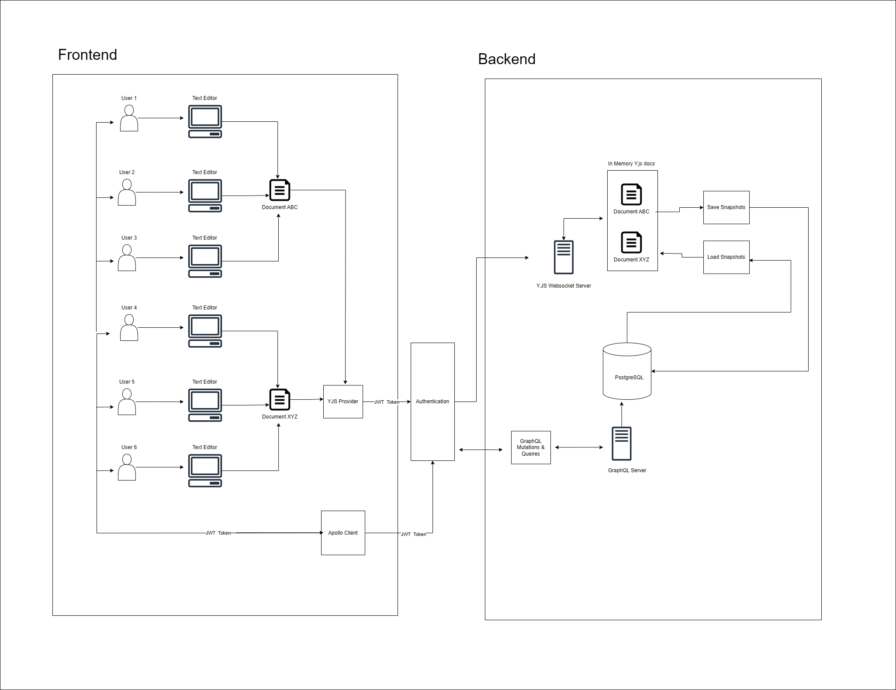

# Bi-Directional Saving Text Editor

This project is a real-time collaborative text editor with bi-directional saving capabilities. The frontend is built using React and TypeScript, focusing on real-time editing, multi-client syncing, and offline support.

**Live Demo:** [Click here to try it out](https://lottie-text-editor-production.up.railway.app/)

**Demo:**
https://www.loom.com/share/791892fb99f54697b9e54deb793b1096

**Orignal Repoistories**:

[Frontend Github Repo](https://github.com/qrafter/lottie-text-editor)
[Backend Github Repo](https://github.com/qrafter/lottie-text-editor-backend)


You can sign in using the following account or create your own. All documents in the app are shareable:

- **Email:** admin@email.com
- **Password:** 123456

## Features

1. **Text Editor Implementation**
   - Basic interface using React and ReactQuill
   - Real-time text editing

2. **Multi-Client Syncing**
   - Conflict resolution for simultaneous edits from multiple clients

3. **GraphQL API Integration**
   - Apollo Client for GraphQL operations
   - Queries: `useGetDocument`, `useGetDocuments`
   - Mutations: `useCreateBlankDocument`, `useUpdateDocumentTitle`

4. **Offline Support**
   - Local storage using IndexedDB (Y-IndexedDB)
   - Sync mechanism to reconcile offline changes upon reconnection

5. **Performance Optimization**
   - Efficient handling of large documents (Y.js)
   - Optimized saving and syncing for high-frequency updates

## Tech Stack

- **React** for the UI
- **TypeScript** for static typing
- **Apollo Client** for GraphQL operations
- **Y.js** for conflict resolution (CRDT)
- **Y-WebSocket** for real-time collaboration
- **ReactQuill** for rich text editing
- **React Router** for navigation
- **Tailwind CSS** and **DaisyUI** for styling
- **GraphQL Yoga** for building the GraphQL server
- **Zustand** for state management
- **TypeORM** for database operations

## Key Components

1. Real-Time Collaborative Editing
2. Automatic Saving and Syncing
3. Offline Editing Support
4. User Authentication and Document Ownership
5. Efficient Handling of Large Documents
6. Conflict-Free Resolution of Concurrent Edits

## Setup and Installation

### Client

1. **Clone the repository.**
2. Navigate to the client directory:
   ```bash
   cd client
   ```
3. **Install dependencies:**
   ```bash
   yarn install
   ```
4. **Set up environment variables:**
   - Create a `.env` file based on `.env.example`.
5. **Run the development server:**
   ```bash
   yarn dev
   ```

### Server

1. **Clone the repository.**
2. Navigate to the server directory:
   ```bash
   cd server
   ```
3. **Install dependencies:**
   ```bash
   yarn install
   ```
4. **Set up environment variables:**
   - Create a `.env` file based on `.env.example`.
5. **Run the GraphQL server:**
   ```bash
   yarn graphql
   ```
6. **Run the Y.js WebSocket server:**
   ```bash
   yarn dev:yjs
   ```
   
### Architectural Overview



## Implementation Details

### Real-Time Collaboration

The project uses **Y.js** with **Y-WebSocket** for real-time collaboration. The `DocumentEditor` component sets up the Y.js document and bindings, ensuring changes are synchronized across all clients. Y.js documents are managed on the Y-WebSocket server, where they are saved and cleared when not in use.

### Offline Support

Offline support is implemented using **Y-IndexedDB** to persist document changes locally. When a connection is restored, changes automatically sync with the server. The app also uses **VitePWA** to function without an internet connection.

### GraphQL Integration

**GraphQL Yoga** is used for GraphQL operations. Custom hooks like `useGetDocument`, `useGetDocuments`, `useCreateBlankDocument`, and `useUpdateDocumentTitle` encapsulate GraphQL queries and mutations for a clean data management interface.


### Performance Considerations

- **Efficient Data Structures:** Y.js effectively handles large text documents and provides built-in conflict resolution.
- **Debouncing:** Implemented for document title updates to reduce unnecessary API calls.
- **Component Optimization:** Utilizes `React.memo` and `useMemo` for optimized rendering.

## Challenges and Solutions

1. **Real-Time Synchronization:** Y.js and Y-WebSocket were key to handling concurrent edits and conflict resolution for multiple clients.
2. **Offline Support:** Implemented using **VitePWA** to ensure the app works without an internet connection.
3. **Offline-to-Online Syncing:** **Y-IndexedDB** switches to local storage when offline and synchronizes changes when back online.
4. **Limited Documentation for Y.js:** Required extensive research, including reading forums and library source code, to understand how Y-WebSocket works.
5. **Centralized Document Management:** Implemented periodic snapshots of Y.js documents and a mechanism to clear inactive ones, effectively managing memory usage.

## Future Improvements

1. **Move Y.js Documents to Redis:** Transitioning from in-memory storage to Redis for better scalability.
2. **Save on Last Collaborator Disconnect:** Implement logic to save in-memory Y.js documents when the last collaborator disconnects.
3. **Diffing Strategy:** Update only the parts of the snapshot that have changed to optimize syncing.
4. **Extend Y.js Data Structures:** Adapt Y.js to handle various asset types.
5. **Frontend Optimization:** Improve the frontend for efficient loading and rendering of different asset types.
